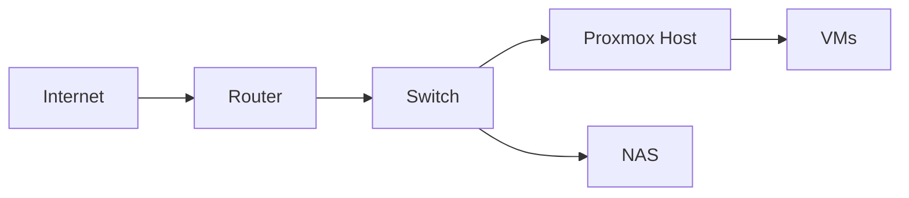

# Wiki Documentation Creation Guide

A comprehensive guide for creating homelab wiki documentation on the Localhake site. This guide covers everything from quick start to advanced Docusaurus features for documentation pages.

## Table of Contents

- [Quick Start](#quick-start)
- [Directory Structure](#directory-structure)
- [Front Matter Reference](#front-matter-reference)
- [Creating New Categories](#creating-new-categories)
- [Sidebar Configuration](#sidebar-configuration)
- [Docusaurus Features](#docusaurus-features)
- [Cross-Linking](#cross-linking)
- [Images](#images)
- [Templates](#templates)

---

## Quick Start

Create a new wiki documentation page in 5 simple steps:

### 1. Choose the Category

Determine which category your documentation belongs to:

| Category | Path | Description |
|----------|------|-------------|
| Overview | `docs/overview/` | General homelab information |
| Hosts | `docs/hosts/` | Physical and virtual host documentation |
| Equipment | `docs/equipment/` | Hardware and networking equipment |
| Services | `docs/services/` | Self-hosted services and applications |

### 2. Create the Documentation File

Create a new `.md` file in the appropriate category:

```bash
# Example: Creating a new service documentation page
touch docs/services/plex.md
```

### 3. Add Front Matter

Add the required front matter at the top of your file:

```md
---
title: Plex Media Server
sidebar_label: Plex
sidebar_position: 2
description: Configuration and setup details for Plex Media Server
---
```

### 4. Write Your Content

Add your documentation content using Markdown:

```md
# Plex Media Server

Overview of the Plex setup in this homelab.

## Configuration

Details about the configuration...

## Access

How to access the service...
```

### 5. Preview and Deploy

```bash
# Preview locally
pnpm start
```

Visit `http://localhost:3000/wiki/services/plex` to preview.

```bash
# Commit and deploy
git add .
git commit -m "Add wiki: Plex Media Server documentation"
git push
```

Vercel will automatically deploy your changes.

:::tip
The wiki is served at the `/wiki` route. Your page URL will be `/wiki/{category}/{filename}` (without the `.md` extension).
:::

---

## Directory Structure

The wiki documentation is organized in the `docs/` directory with a category-based structure. Each category is a subdirectory containing related documentation pages.

### Current Structure

```
docs/
├── overview/           # General homelab information
│   └── index.md        # Category landing page (sidebar_position: 1)
├── hosts/              # Physical and virtual host documentation
│   └── index.md        # Category landing page (sidebar_position: 2)
├── equipment/          # Hardware and networking equipment
│   └── index.md        # Category landing page (sidebar_position: 3)
└── services/           # Self-hosted services and applications
    └── index.md        # Category landing page (sidebar_position: 4)
```

### Category Descriptions

| Category | Purpose | Example Content |
|----------|---------|-----------------|
| **overview** | General homelab information and introduction | What is a homelab, infrastructure overview, getting started |
| **hosts** | Physical and virtual host documentation | Server specs, VM configurations, Docker hosts |
| **equipment** | Hardware and networking equipment | Routers, switches, NAS, UPS, rack setup |
| **services** | Self-hosted services and applications | Plex, Home Assistant, Grafana, reverse proxy |

### File Naming Conventions

- **Category landing pages**: Use `index.md` for the main page of each category
- **Individual pages**: Use lowercase with hyphens (e.g., `plex-media-server.md`)
- **File extension**: Use `.md` for standard Markdown (`.mdx` if you need React components)

### URL Mapping

Files in the `docs/` directory map to URLs under the `/wiki` route:

| File Path | URL |
|-----------|-----|
| `docs/overview/index.md` | `/wiki/overview` |
| `docs/services/plex.md` | `/wiki/services/plex` |
| `docs/hosts/proxmox-ve.md` | `/wiki/hosts/proxmox-ve` |
| `docs/equipment/unifi-switch.md` | `/wiki/equipment/unifi-switch` |

:::info
The `/wiki` route is configured in `docusaurus.config.ts` via the `routeBasePath` option in the docs plugin.
:::

---

## Front Matter Reference

Front matter is YAML metadata at the top of each documentation file. It controls how the page appears in the sidebar and search results.

### Required Fields

Every wiki documentation page should include these fields:

```yaml
---
title: Page Title
sidebar_label: Sidebar Label
sidebar_position: 1
description: A brief description for SEO and search results
---
```

### Field Descriptions

| Field | Type | Required | Description |
|-------|------|----------|-------------|
| `title` | string | ✅ Yes | The page title displayed in the browser tab and as the main heading |
| `sidebar_label` | string | ✅ Yes | The label shown in the sidebar navigation (can be shorter than title) |
| `sidebar_position` | number | ✅ Yes | Order within the category (1-based, lower numbers appear first) |
| `description` | string | ✅ Yes | Meta description for SEO and search result snippets |

### Optional Fields

```yaml
---
title: Page Title
sidebar_label: Sidebar Label
sidebar_position: 1
description: A brief description
slug: custom-url-slug        # Override the default URL slug
hide_table_of_contents: true # Hide the right-side TOC
keywords: [keyword1, keyword2] # Additional SEO keywords
---
```

| Field | Type | Default | Description |
|-------|------|---------|-------------|
| `slug` | string | filename | Custom URL slug (overrides the filename) |
| `hide_table_of_contents` | boolean | `false` | Hide the table of contents on the right side |
| `keywords` | string[] | `[]` | Additional keywords for SEO |
| `draft` | boolean | `false` | Mark as draft (won't appear in production) |

### Examples from Existing Pages

**Overview Page** (`docs/overview/index.md`):
```yaml
---
title: Overview
sidebar_label: Overview
sidebar_position: 1
description: General overview of Hake's Homelab infrastructure
---
```

**Services Page** (`docs/services/index.md`):
```yaml
---
title: Services
sidebar_label: Services
sidebar_position: 4
description: Self-hosted services and applications running in the homelab
---
```

### Best Practices

1. **Keep `sidebar_label` concise**: Use short labels for cleaner navigation
2. **Write descriptive `description`**: This appears in search results and social shares
3. **Use sequential `sidebar_position`**: Start at 1 and increment for each page in a category
4. **Match `title` and heading**: The `title` should match your `# Heading` for consistency

:::tip
If you want a page to appear at the top of a category, use `sidebar_position: 1`. Category index pages typically use position 1.
:::

---

## Sidebar Configuration

The wiki sidebar is configured in `sidebars.ts` at the project root. This project uses **autogenerated sidebars** based on the directory structure.

### Current Configuration

```typescript
// sidebars.ts
import type {SidebarsConfig} from '@docusaurus/plugin-content-docs';

const sidebars: SidebarsConfig = {
  // Autogenerate sidebar from docs folder structure
  wikiSidebar: [{type: 'autogenerated', dirName: '.'}],
};

export default sidebars;
```

### How Autogenerated Sidebars Work

With autogenerated sidebars:

1. **Directories become categories**: Each subdirectory in `docs/` becomes a collapsible category
2. **Files become pages**: Each `.md` file becomes a sidebar item
3. **Ordering uses `sidebar_position`**: Pages are sorted by their `sidebar_position` front matter
4. **Category labels use `_category_.json`**: Optional file to customize category appearance

### Sidebar Ordering

Pages within a category are ordered by `sidebar_position`:

```
services/
├── index.md          # sidebar_position: 1 → appears first
├── plex.md           # sidebar_position: 2 → appears second
├── home-assistant.md # sidebar_position: 3 → appears third
└── grafana.md        # sidebar_position: 4 → appears fourth
```

### Category Ordering

Categories (directories) are ordered by the `sidebar_position` of their `index.md` file:

| Category | Index Position | Sidebar Order |
|----------|----------------|---------------|
| overview | 1 | First |
| hosts | 2 | Second |
| equipment | 3 | Third |
| services | 4 | Fourth |

### Customizing Category Appearance

You can add a `_category_.json` file to customize how a category appears:

```json
{
  "label": "Self-Hosted Services",
  "position": 4,
  "collapsed": false,
  "collapsible": true,
  "link": {
    "type": "generated-index",
    "description": "All self-hosted services in the homelab"
  }
}
```

| Property | Description |
|----------|-------------|
| `label` | Display name in the sidebar |
| `position` | Order among sibling categories |
| `collapsed` | Whether the category starts collapsed |
| `collapsible` | Whether the category can be collapsed |
| `link` | Category landing page configuration |

:::note
The current setup uses `index.md` files for category landing pages instead of `_category_.json`. Both approaches work—choose based on whether you need a full content page (use `index.md`) or just a generated index (use `_category_.json`).
:::

### Manual Sidebar Configuration

If you need more control, you can switch to manual sidebar configuration:

```typescript
// sidebars.ts - Manual configuration example
const sidebars: SidebarsConfig = {
  wikiSidebar: [
    {
      type: 'category',
      label: 'Overview',
      items: ['overview/index'],
    },
    {
      type: 'category',
      label: 'Hosts',
      items: ['hosts/index', 'hosts/proxmox', 'hosts/docker'],
    },
    // ... more categories
  ],
};
```

:::tip
Stick with autogenerated sidebars unless you need specific ordering that can't be achieved with `sidebar_position`. It's easier to maintain as you add new pages.
:::

---

## Creating New Categories

Categories in the wiki are created by adding new directories to the `docs/` folder. With autogenerated sidebars, new directories automatically become collapsible categories in the navigation.

### Step-by-Step: Adding a New Category

#### 1. Create the Directory

Create a new directory in `docs/` for your category:

```bash
# Example: Adding a "networking" category
mkdir docs/networking
```

#### 2. Create the Category Index Page

Every category needs an `index.md` file that serves as the category landing page:

```bash
touch docs/networking/index.md
```

Add the front matter and content:

```md
---
title: Networking
sidebar_label: Networking
sidebar_position: 5
description: Network infrastructure, VLANs, and firewall configuration
---

# Networking

This section covers the network infrastructure of the homelab.

## Topics

- VLAN configuration
- Firewall rules
- DNS setup
- VPN configuration
```

:::important
The `sidebar_position` in the index file determines where the category appears in the sidebar relative to other categories.
:::

#### 3. Add Documentation Pages

Add individual documentation pages to your new category:

```bash
touch docs/networking/vlans.md
touch docs/networking/firewall.md
```

Example page (`docs/networking/vlans.md`):

```md
---
title: VLAN Configuration
sidebar_label: VLANs
sidebar_position: 2
description: How VLANs are configured in the homelab network
---

# VLAN Configuration

Details about VLAN setup...
```

#### 4. Verify the Structure

Your new category should look like this:

```
docs/
├── overview/
├── hosts/
├── equipment/
├── services/
└── networking/          # New category
    ├── index.md         # sidebar_position: 5 (category order)
    ├── vlans.md         # sidebar_position: 2
    └── firewall.md      # sidebar_position: 3
```

### Alternative: Using `_category_.json`

Instead of an `index.md` file, you can use `_category_.json` for categories that don't need a full landing page:

```json
{
  "label": "Networking",
  "position": 5,
  "collapsed": true,
  "collapsible": true,
  "link": {
    "type": "generated-index",
    "title": "Networking Documentation",
    "description": "Network infrastructure and configuration guides"
  }
}
```

**When to use each approach:**

| Approach | Use When |
|----------|----------|
| `index.md` | You want a full content page with custom text, images, or detailed overview |
| `_category_.json` | You just need a simple auto-generated index of pages in the category |

### Creating Subcategories

You can create nested categories by adding subdirectories:

```
docs/
└── services/
    ├── index.md
    ├── media/                    # Subcategory
    │   ├── index.md
    │   ├── plex.md
    │   └── jellyfin.md
    └── monitoring/               # Subcategory
        ├── index.md
        ├── grafana.md
        └── prometheus.md
```

Each subcategory needs its own `index.md` or `_category_.json` file.

### Category Naming Best Practices

1. **Use lowercase**: `networking` not `Networking`
2. **Use hyphens for multi-word names**: `home-automation` not `home_automation`
3. **Keep names short but descriptive**: `services` not `self-hosted-services-and-applications`
4. **Be consistent**: Match the naming style of existing categories

---

## Cross-Linking

Cross-linking allows you to connect related documentation pages, making it easier for readers to navigate between topics.

### Basic Linking Syntax

Docusaurus supports both relative and absolute paths for internal links.

#### Relative Paths (Recommended)

Use relative paths from the current file's location:

```md
<!-- From docs/services/plex.md linking to docs/services/jellyfin.md -->
See also: [Jellyfin](./jellyfin.md)

<!-- From docs/services/plex.md linking to docs/hosts/index.md -->
This runs on the [media server host](../hosts/index.md).

<!-- From docs/services/plex.md linking to docs/equipment/nas.md -->
Media is stored on the [NAS](../equipment/nas.md).
```

#### Absolute Paths

Use absolute paths from the `docs/` root (start with `/`):

```md
<!-- Absolute path from any file -->
See the [Overview](/overview/index.md) for more information.

<!-- Link to a specific page -->
Check the [Grafana setup](/services/grafana.md).
```

### Linking Examples

#### Same Category

When linking to pages in the same category, use `./`:

```md
<!-- In docs/services/plex.md -->
For media management, see [Sonarr](./sonarr.md) and [Radarr](./radarr.md).
```

#### Different Category

When linking to pages in a different category, use `../`:

```md
<!-- In docs/services/plex.md linking to hosts -->
Plex runs on the [Proxmox host](../hosts/proxmox.md).

<!-- In docs/hosts/proxmox.md linking to services -->
This host runs [Plex](../services/plex.md) and [Home Assistant](../services/home-assistant.md).
```

#### Category Index Pages

Link to category landing pages using the `index.md` file:

```md
<!-- Link to the Services category overview -->
See all [available services](../services/index.md).

<!-- Or use the directory path (Docusaurus resolves this) -->
See all [available services](../services/).
```

### Linking to Specific Sections

Link to specific headings within a page using anchor links:

```md
<!-- Link to a heading on the same page -->
See [Configuration](#configuration) below.

<!-- Link to a heading on another page -->
Check the [VLAN setup](../networking/vlans.md#vlan-configuration).
```

:::tip
Heading anchors are auto-generated from the heading text:
- `## My Heading` → `#my-heading`
- `## Configuration Options` → `#configuration-options`
- `## Step 1: Install` → `#step-1-install`
:::

### Practical Cross-Linking Patterns

#### Service-to-Host Linking

Document which host runs each service:

```md
<!-- In docs/services/plex.md -->
## Deployment

Plex is deployed as a Docker container on the [Docker host](../hosts/docker-host.md).

### Hardware Requirements

The transcoding relies on the GPU in the [media server](../hosts/media-server.md#gpu-passthrough).
```

#### Equipment-to-Service Linking

Connect equipment to the services that use it:

```md
<!-- In docs/equipment/nas.md -->
## Services Using This NAS

The following services store data on this NAS:
- [Plex Media Server](../services/plex.md) - Media library storage
- [Nextcloud](../services/nextcloud.md) - File sync storage
- [Paperless-ngx](../services/paperless.md) - Document archive
```

#### Related Pages Section

Add a "Related Pages" section at the bottom of documentation:

```md
## Related Pages

- [Proxmox Host](../hosts/proxmox.md) - The hypervisor running this VM
- [Grafana](../services/grafana.md) - Monitoring dashboard for this service
- [Network Configuration](../networking/vlans.md) - VLAN setup for service isolation
```

### Link Validation

Docusaurus validates internal links during build. Broken links will cause build warnings:

```bash
# Run a build to check for broken links
pnpm build
```

Example warning output:
```
[WARNING] Docs markdown link couldn't be resolved: (../hosts/nonexistent.md) in docs/services/plex.md
```

:::warning
Always run `pnpm build` before committing to catch broken links. The build will warn you about any links that don't resolve to actual pages.
:::

### Best Practices for Cross-Linking

1. **Use relative paths**: They're more maintainable if you reorganize the docs structure
2. **Link contextually**: Add links where they provide value, not just for the sake of linking
3. **Use descriptive link text**: `[Plex configuration](./plex.md)` not `[click here](./plex.md)`
4. **Add "Related Pages" sections**: Help readers discover related content
5. **Verify links before committing**: Run `pnpm build` to catch broken links
6. **Keep links up to date**: When renaming or moving pages, update all links to them

---

## Custom Components

The wiki uses custom React components that are globally available in all MDX files. These components are registered in `src/theme/MDXComponents.tsx` and can be used without imports.

### AffiliateLink

The `AffiliateLink` component renders Amazon affiliate links with proper FTC disclosure, accessibility attributes, and consistent styling. Use this when recommending products or equipment in your wiki documentation.

#### Props

| Prop | Type | Required | Description |
|------|------|----------|-------------|
| `url` | `string` | Yes | Amazon URL (short URL like `amzn.to/xxx` or full product URL) |
| `title` | `string` | No | Product title to display as link text. Defaults to "View on Amazon" |

#### Supported URL Formats

| Format | Example |
|--------|---------|
| Short URL | `https://amzn.to/3xYz123` |
| US Product | `https://www.amazon.com/dp/B08N5WRWNW` |
| UK Product | `https://www.amazon.co.uk/dp/B08N5WRWNW` |
| Other regions | `https://www.amazon.de/dp/...`, `https://www.amazon.ca/dp/...`, etc. |

#### Usage Examples

**Basic usage:**

```md
<AffiliateLink url="https://amzn.to/3xYz123" title="UniFi Switch 24 PoE" />
```

**In equipment documentation:**

```md title="docs/equipment/networking.md"
## Network Switch

The main network switch is a <AffiliateLink url="https://amzn.to/abc123" title="UniFi Switch 24 PoE" />.

### Specifications

| Property | Value |
|----------|-------|
| Model | USW-24-POE |
| Ports | 24x 1GbE, 2x 10G SFP+ |
| PoE Budget | 95W |
```

**In a hardware specifications table:**

```md title="docs/hosts/proxmox-server.md"
## Hardware

| Component | Model | Link |
|-----------|-------|------|
| CPU | Intel i7-12700 | - |
| RAM | 64GB DDR4 | <AffiliateLink url="https://amzn.to/def456" title="Crucial 64GB Kit" /> |
| NVMe | Samsung 980 Pro 2TB | <AffiliateLink url="https://amzn.to/ghi789" title="Samsung 980 Pro" /> |
```

:::tip Best Practice
Always provide a descriptive `title` prop that identifies the product. This improves accessibility and helps readers understand what they're clicking on.
:::

#### Behavior Notes

- **FTC Disclosure**: A tooltip with "As an Amazon Associate, I earn from qualifying purchases." appears on hover
- **Visual Indicator**: Links are styled in orange to distinguish them from regular links (Amazon-inspired color)
- **Accessibility**: Includes `aria-label` describing the affiliate nature and that it opens in a new tab
- **Error Handling**: Invalid URLs display a user-friendly error message

---

## Docusaurus Features

Docusaurus provides several built-in features that enhance your wiki documentation. These features are available in all Markdown files without any imports.

### Admonitions

Admonitions are callout boxes that highlight important information. Use them to draw attention to tips, warnings, or critical information.

#### Available Types

| Type | Use Case |
|------|----------|
| `note` | General information or clarification |
| `tip` | Helpful suggestions or best practices |
| `info` | Additional context or background information |
| `warning` | Potential issues or things to be careful about |
| `danger` | Critical warnings about destructive actions or security risks |

#### Syntax

```md
:::note
This is a general note with additional information.
:::

:::tip
This is a helpful tip or best practice.
:::

:::info
This provides additional context or background information.
:::

:::warning
Be careful! This warns about potential issues.
:::

:::danger
Critical warning! This action could cause data loss or security issues.
:::
```

#### With Custom Titles

You can customize the admonition title:

```md
:::tip Pro Tip
Use environment variables for sensitive configuration values.
:::

:::warning Compatibility Notice
This feature requires Proxmox VE 8.0 or later.
:::

:::danger Data Loss Warning
Running this command will permanently delete all data. Make sure you have a backup!
:::
```

#### Practical Examples for Wiki Documentation

**Tip for configuration:**

```md
:::tip Best Practice
Always document the IP address and port for each service. This makes troubleshooting much easier when something goes wrong.
:::
```

**Warning about prerequisites:**

```md
:::warning Hardware Requirements
This service requires at least 8GB of RAM. Running with less memory may cause performance issues or crashes.
:::
```

**Info for context:**

```md
:::info Network Configuration
This host is on VLAN 10 (Management) and has access to VLAN 20 (Services) for container networking.
:::
```

**Danger for destructive operations:**

```md
:::danger Destructive Action
The following command will wipe the disk and all data:
```bash
dd if=/dev/zero of=/dev/sda bs=1M
```
This cannot be undone. Ensure you have backups before proceeding.
:::
```

---

### Code Blocks

Code blocks support syntax highlighting, line highlighting, line numbers, and titles.

#### Basic Syntax Highlighting

Specify the language after the opening backticks:

````md
```bash
docker compose up -d
```

```yaml
version: '3.8'
services:
  app:
    image: nginx:latest
```

```typescript
const greeting: string = "Hello, World!";
console.log(greeting);
```
````

#### Supported Languages

Common languages used in homelab documentation:

| Language | Identifier |
|----------|------------|
| Bash/Shell | `bash`, `shell`, `sh` |
| YAML | `yaml`, `yml` |
| JSON | `json` |
| TypeScript | `typescript`, `ts` |
| JavaScript | `javascript`, `js` |
| Docker | `dockerfile` |
| Nginx | `nginx` |
| Python | `python`, `py` |
| SQL | `sql` |
| TOML | `toml` |
| INI | `ini` |

#### Code Block Titles

Add a title to show the filename or context:

````md
```yaml title="docker-compose.yml"
version: '3.8'
services:
  plex:
    image: lscr.io/linuxserver/plex:latest
    ports:
      - "32400:32400"
```

```bash title="Terminal"
docker compose up -d
```

```ini title="/etc/proxmox/storage.cfg"
dir: local
    path /var/lib/vz
    content iso,vztmpl,backup
```
````

#### Line Highlighting

Highlight specific lines to draw attention:

````md
```yaml title="docker-compose.yml" {4-6}
version: '3.8'
services:
  plex:
    environment:
      - PUID=1000
      - PGID=1000
    ports:
      - "32400:32400"
```
````

You can also use line numbers directly:

````md
```yaml {3,5-7}
version: '3.8'
services:
  plex:  # Line 3 highlighted
    image: lscr.io/linuxserver/plex:latest
    environment:  # Lines 5-7 highlighted
      - PUID=1000
      - PGID=1000
```
````

#### Line Numbers

Show line numbers for longer code blocks:

````md
```bash showLineNumbers
#!/bin/bash
# Backup script for homelab

BACKUP_DIR="/mnt/backup"
DATE=$(date +%Y-%m-%d)

echo "Starting backup..."
rsync -avz /home/user/docker "$BACKUP_DIR/$DATE/"
echo "Backup complete!"
```
````

#### Combining Features

You can combine title, line highlighting, and line numbers:

````md
```yaml title="docker-compose.yml" showLineNumbers {5-8}
version: '3.8'
services:
  plex:
    image: lscr.io/linuxserver/plex:latest
    environment:
      - PUID=1000
      - PGID=1000
      - TZ=America/New_York
    volumes:
      - ./config:/config
    ports:
      - "32400:32400"
```
````

---

### Tables

Tables are useful for documenting specifications, configurations, and comparisons in wiki documentation.

#### Basic Table Syntax

```md
| Column 1 | Column 2 | Column 3 |
|----------|----------|----------|
| Row 1    | Data     | Data     |
| Row 2    | Data     | Data     |
| Row 3    | Data     | Data     |
```

#### Column Alignment

Control text alignment with colons in the separator row:

```md
| Left Aligned | Center Aligned | Right Aligned |
|:-------------|:--------------:|--------------:|
| Text         | Text           | Text          |
| More text    | More text      | More text     |
```

#### Practical Examples for Wiki Documentation

**Hardware Specifications:**

```md
| Component | Model | Specs |
|-----------|-------|-------|
| CPU | Intel i7-12700 | 12 cores, 20 threads |
| RAM | Crucial DDR4 | 64GB (4x16GB) |
| Storage | Samsung 980 Pro | 2TB NVMe |
| GPU | NVIDIA RTX 3060 | 12GB VRAM |
```

**Service Port Reference:**

```md
| Service | Port | Protocol | Description |
|---------|------|----------|-------------|
| Plex | 32400 | TCP | Media streaming |
| Home Assistant | 8123 | TCP | Home automation |
| Grafana | 3000 | TCP | Monitoring dashboard |
| Portainer | 9443 | TCP | Container management |
```

**VLAN Configuration:**

```md
| VLAN ID | Name | Subnet | Purpose |
|:-------:|------|--------|---------|
| 10 | Management | 10.0.10.0/24 | Network infrastructure |
| 20 | Services | 10.0.20.0/24 | Self-hosted services |
| 30 | IoT | 10.0.30.0/24 | Smart home devices |
| 40 | Guest | 10.0.40.0/24 | Guest network |
```

**VM Resource Allocation:**

```md
| VM Name | vCPUs | RAM | Storage | Purpose |
|---------|:-----:|:---:|:-------:|---------|
| docker-host | 4 | 16GB | 100GB | Docker containers |
| home-assistant | 2 | 4GB | 32GB | Home automation |
| pihole | 1 | 1GB | 8GB | DNS ad-blocking |
```

:::tip
Keep tables readable by limiting the number of columns. If you need more than 5-6 columns, consider splitting into multiple tables or using a different format.
:::

---

## Images

Images can be added to wiki documentation in two ways: co-located with the documentation page or stored in the static directory.

### Co-located Images (Recommended)

Store images in the same directory as your documentation page. This keeps assets organized with their content.

#### Directory Structure

```
docs/
└── services/
    ├── plex.md
    └── images/
        ├── plex-dashboard.png
        ├── plex-settings.png
        └── plex-architecture.svg
```

Or place images directly alongside the documentation file:

```
docs/
└── equipment/
    ├── unifi-switch.md
    ├── switch-front.png
    └── switch-ports.png
```

#### Usage in Markdown

Reference co-located images with relative paths:

```md
{/* Image in images/ subdirectory */}


{/* Image directly in the same directory */}


{/* With descriptive alt text for accessibility */}

```

### Static Directory Images

For images shared across multiple documentation pages or site-wide assets, use the `static/img/` directory.

#### Directory Structure

```
static/
└── img/
    ├── wiki/
    │   ├── network-topology.svg
    │   └── rack-diagram.png
    └── common/
        └── logo.png
```

#### Usage in Markdown

Reference static images with absolute paths (starting with `/`):

```md


```

### Image Best Practices

1. **Use descriptive alt text**: Describe what the image shows for accessibility and SEO
2. **Optimize file sizes**: Compress images before adding (use tools like ImageOptim, TinyPNG, or Squoosh)
3. **Use appropriate formats**:
   - **PNG**: Screenshots, diagrams with text, images needing transparency
   - **JPEG**: Photos, complex images without transparency
   - **SVG**: Network diagrams, architecture diagrams, logos, icons
   - **WebP**: Modern format with good compression (check browser support)
4. **Consistent naming**: Use lowercase, hyphenated names (`plex-dashboard.png`, `network-diagram.svg`)
5. **Reasonable dimensions**: Resize large images to max ~1200px width for documentation

### Adding Captions

For images that need captions, use a paragraph below:

```md


*The Proxmox VE dashboard showing VM and container status.*
```

Or use HTML for more control:

```md
<figure>
  
  <figcaption>The Proxmox VE dashboard showing VM and container status.</figcaption>
</figure>
```

### Diagrams with Mermaid

For simple diagrams, consider using Mermaid instead of images. Mermaid diagrams are text-based and render automatically:

````md

````

:::tip
Mermaid diagrams are great for network topologies, flowcharts, and architecture diagrams. They're version-controlled as text and easy to update.
:::

---

## Templates

Copy-paste templates for creating new wiki documentation pages.

### Basic Documentation Page Template

For standard documentation pages:

```md
---
title: Service/Equipment Name
sidebar_label: Short Label
sidebar_position: 2
description: Brief description of what this page documents
---

# Service/Equipment Name

Brief introduction explaining what this is and its role in the homelab.

## Overview

High-level overview of the service or equipment, including:
- What it does
- Why it's used
- Key features

## Specifications

| Property | Value |
|----------|-------|
| Version | 1.0.0 |
| Host | docker-host |
| Port | 8080 |
| URL | http://10.0.20.10:8080 |

## Configuration

### Docker Compose

```yaml title="docker-compose.yml"
version: '3.8'
services:
  service-name:
    image: image:latest
    container_name: service-name
    ports:
      - "8080:8080"
    volumes:
      - ./config:/config
    restart: unless-stopped
```

### Environment Variables

| Variable | Description | Default |
|----------|-------------|---------|
| `TZ` | Timezone | `UTC` |
| `PUID` | User ID | `1000` |
| `PGID` | Group ID | `1000` |

## Access

- **Web UI**: http://10.0.20.10:8080
- **API**: http://10.0.20.10:8080/api

## Maintenance

### Backup

Describe backup procedures...

### Updates

```bash
docker compose pull
docker compose up -d
```

## Troubleshooting

### Common Issue 1

Description and solution...

### Common Issue 2

Description and solution...

## Related Pages

- [Docker Host](../hosts/docker-host.md) - The host running this service
- [Related Service](./related-service.md) - Integration details
```

### Host Documentation Template

For documenting physical or virtual hosts:

```md
---
title: Host Name
sidebar_label: Host Name
sidebar_position: 2
description: Documentation for the host-name server
---

# Host Name

Brief description of this host's purpose in the homelab.

## Hardware Specifications

| Component | Details |
|-----------|---------|
| **Model** | Dell PowerEdge R720 |
| **CPU** | 2x Intel Xeon E5-2670 |
| **RAM** | 128GB DDR3 ECC |
| **Storage** | 8x 4TB HDD (RAID 6) |
| **Network** | 4x 1GbE, 2x 10GbE |
| **Power** | 2x 750W PSU |

## Network Configuration

| Interface | IP Address | VLAN | Purpose |
|-----------|------------|------|---------|
| eth0 | 10.0.10.5 | 10 | Management |
| eth1 | 10.0.20.5 | 20 | Services |

## Operating System

- **OS**: Proxmox VE 8.1
- **Kernel**: 6.5.x
- **Last Updated**: 2024-01-15

## Services Running

| Service | Type | Resources |
|---------|------|-----------|
| docker-host | VM | 4 vCPU, 16GB RAM |
| home-assistant | LXC | 2 vCPU, 4GB RAM |
| pihole | LXC | 1 vCPU, 1GB RAM |

## Storage Layout

```
/dev/sda - 500GB SSD (OS)
├── /dev/sda1 - /boot (1GB)
├── /dev/sda2 - / (100GB)
└── /dev/sda3 - /var/lib/vz (399GB)

/dev/md0 - 24TB RAID 6 (Data)
└── /mnt/data
```

## Maintenance

### Backup Schedule

- **Daily**: VM snapshots at 2:00 AM
- **Weekly**: Full backup to NAS on Sundays

### Update Procedure

```bash
apt update && apt upgrade -y
pveam update
```

## Related Pages

- [Services Overview](../services/index.md) - Services running on this host
- [Network Equipment](../equipment/unifi-switch.md) - Connected switch
```

### Equipment Documentation Template

For documenting hardware and networking equipment:

```md
---
title: Equipment Name
sidebar_label: Equipment Name
sidebar_position: 2
description: Documentation for the equipment-name in the homelab
---

# Equipment Name

Brief description of this equipment and its role in the homelab.

## Specifications

| Property | Value |
|----------|-------|
| **Manufacturer** | Ubiquiti |
| **Model** | USW-Pro-24-PoE |
| **Ports** | 24x 1GbE PoE+, 2x 10G SFP+ |
| **PoE Budget** | 400W |
| **Management** | UniFi Controller |

## Physical Location

- **Rack**: Main rack, U12
- **Power**: PDU 1, Outlet 5

## Network Configuration

| Port | Device | VLAN | Notes |
|------|--------|------|-------|
| 1 | Proxmox Host | Trunk | All VLANs |
| 2 | NAS | 20 | Services VLAN |
| 3-8 | Access Points | 10, 30, 40 | Management + WiFi VLANs |
| 9-16 | IoT Devices | 30 | IoT VLAN only |
| SFP+ 1 | Core Router | Trunk | 10G uplink |

## Configuration

### VLAN Setup

| VLAN ID | Name | Ports |
|:-------:|------|-------|
| 10 | Management | 1-8 (tagged) |
| 20 | Services | 1-2 (tagged) |
| 30 | IoT | 1, 3-16 (tagged) |
| 40 | Guest | 1, 3-8 (tagged) |

### Port Profiles

Document any custom port profiles...

## Maintenance

### Firmware Updates

Updated via UniFi Controller. Current version: 6.5.x

### Monitoring

- **UniFi Controller**: https://10.0.10.1:8443
- **SNMP**: Enabled for Grafana monitoring

## Related Pages

- [Network Overview](../overview/network.md) - Network architecture
- [Proxmox Host](../hosts/proxmox.md) - Connected server
```

### Category Index Template

For category landing pages (`index.md`):

```md
---
title: Category Name
sidebar_label: Category Name
sidebar_position: 1
description: Overview of the category-name section
---

# Category Name

Brief introduction to this category and what documentation it contains.

## What's in This Section

| Page | Description |
|------|-------------|
| [Page 1](./page-1.md) | Brief description |
| [Page 2](./page-2.md) | Brief description |
| [Page 3](./page-3.md) | Brief description |

## Overview

Provide a high-level overview of the category topic. For example:
- For **Services**: What types of services are self-hosted
- For **Hosts**: Overview of the server infrastructure
- For **Equipment**: Summary of networking and hardware

## Quick Links

- [Most commonly accessed page](./common-page.md)
- [Getting started guide](./getting-started.md)

## Related Categories

- [Related Category 1](../related-category/index.md)
- [Related Category 2](../other-category/index.md)
```
