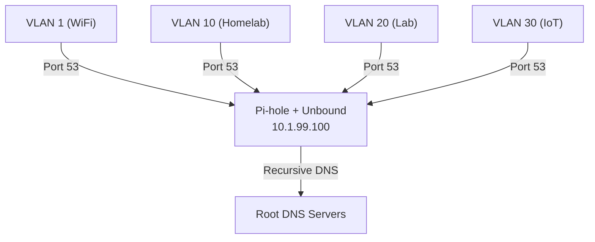

# DNS

All DNS in the homelab is intercepted and forced through Pi-hole with Unbound as the upstream recursive resolver. Even devices with hardcoded DNS servers (like smart TVs pointing at Google's `8.8.8.8`) get their requests redirected. DNS lives on its own VLAN (99) for additional isolation.

## Architecture

## How It Works

1. **All VLANs** are configured with Pi-hole (10.1.99.100) as their DNS server via DHCP — well-behaved devices use this automatically
2. **UniFi NAT policy** intercepts all outbound DNS traffic (port 53) and redirects it to Pi-hole — this catches the naughty devices that ignore DHCP and try to use their own hardcoded DNS (like a smart TV reaching out to `8.8.8.8`). The device never knows its request was redirected.
3. **Firewall block rules** drop any outbound DNS that doesn't originate from VLAN 99, as a fallback
4. **Pi-hole** handles ad-blocking and forwards queries to **Unbound**
5. **Unbound** performs recursive DNS resolution directly against root servers — no upstream DNS provider (Google, Cloudflare, etc.)

Having Pi-hole on its own dedicated VLAN (99) makes the UniFi NAT policy simpler — the rule just listens on each VLAN for anything trying to reach out on port 53 and redirects it to Pi-hole's known address on VLAN 99.

## Why Unbound?

Most DNS setups forward queries to an upstream provider like `8.8.8.8` or `1.1.1.1`. Unbound resolves queries recursively starting from the root DNS servers, which means:

- No single upstream provider sees all your DNS queries
- Eliminates a potential point of censorship or logging
- Slightly slower for first-time queries, but Unbound caches aggressively

## Why a Separate VLAN for DNS?

Two reasons:

1. **Cleaner NAT policy** — with Pi-hole on a dedicated VLAN, the UniFi interception rule is straightforward: redirect port 53 traffic from any other VLAN to a single known IP on VLAN 99. No exceptions or exclusions needed on the main VLAN.
2. **Isolation** — no rogue device on another VLAN can impersonate or interfere with the DNS server, since they can't reach VLAN 99 except through the allowed DNS path.

:::note Limitations
DNS interception only catches standard DNS on port 53. DNS-over-HTTPS (DoH) on port 443 and DNS-over-TLS (DoT) on port 853 can bypass these rules. Blocking known public DoH/DoT endpoints (like `dns.google` or `cloudflare-dns.com`) is a further mitigation if needed.
:::

## Service Details

| Property | Value |
|----------|-------|
| Service | Pi-hole + Unbound |
| VMID | 100 |
| IP | 10.1.99.100 |
| VLAN | 99 |
| Host | ceres |
| Type | LXC |

See [Pi-hole service page](../services/infrastructure/pihole.md) for container specs and configuration details.

## Related Pages

- [Firewall](./firewall.md) — DNS-related firewall rules
- [VLANs](./vlans.md) — VLAN 99 details
- [Pi-hole](../services/infrastructure/pihole.md) — service configuration
