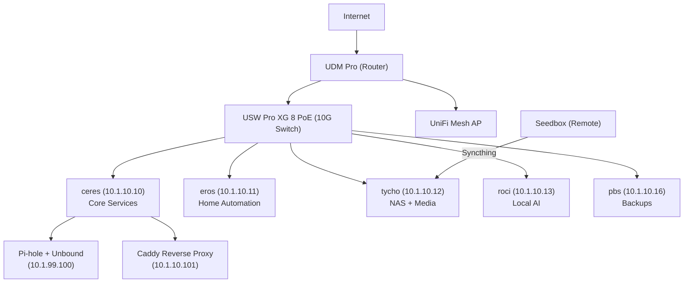
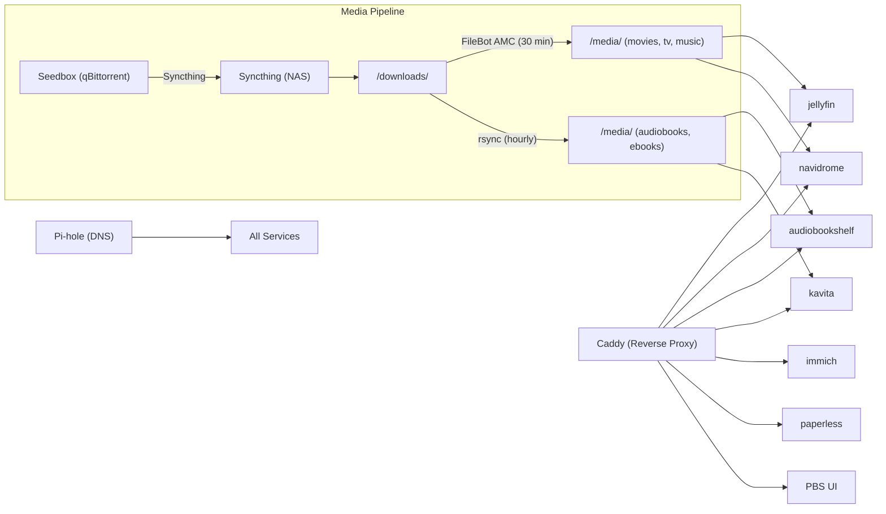
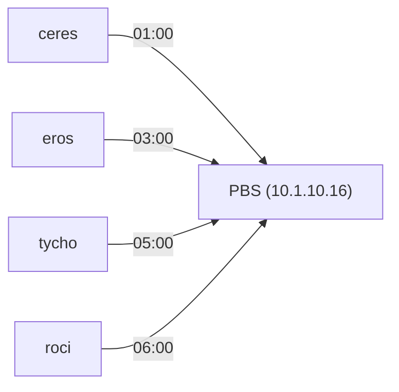

# Architecture

This page covers how the homelab fits together at a high level — the network topology, service distribution across hosts, and how media flows from the internet to your screen.

## Network Topology



## Host Responsibilities

Each Proxmox host has a clear role:

| Host | Role | Key Services |
|------|------|-------------|
| **ceres** | Core infrastructure | Pi-hole, Caddy, Vaultwarden, Uptime Kuma, Homepage |
| **eros** | Home automation + productivity | Home Assistant, n8n, Mealie, Actual Budget |
| **tycho** | NAS + media | Jellyfin, Navidrome, Audiobookshelf, Kavita, Immich, Paperless-ngx, Syncthing, FileBot |
| **roci** | Local AI | Ollama, Paperless-GPT, Paperless-AI |
| **pbs** | Backups | Proxmox Backup Server |

## Service Dependencies



## Media Flow

The media pipeline is the most complex data flow in the homelab:

1. **Manually add torrent** to qBittorrent on seedbox (with category: movies, tv, music, etc.)
2. **qBittorrent downloads** to `~/downloads/qbittorrent/complete/{category}/`
3. **Syncthing syncs** completed files to tycho NAS at `/downloads/{category}/`
4. **FileBot AMC** runs every 30 minutes — auto-sorts movies, TV, and music into `/media/`
5. **rsync script** runs hourly — copies audiobooks and ebooks into `/media/`
6. **Streaming apps** (Jellyfin, Navidrome, Audiobookshelf, Kavita) pick up new content automatically
7. **qBittorrent seeds** for 14 days or 1:1 ratio, then auto-deletes

```
/media/
├── movies/         → Jellyfin
│   └── Movie Name (Year)/
├── tv/             → Jellyfin
│   └── Show Name/Season 01/
├── music/          → Navidrome
│   └── Artist/Album/
├── audiobooks/     → Audiobookshelf
│   └── Author/Book Title/
└── ebooks/         → Kavita
    └── Author/Book Title.epub
```

## Backup Flow

All Proxmox hosts back up to PBS nightly on a staggered schedule:



See [PBS host documentation](../hosts/pbs.md) for retention policies and disaster recovery.

## Related Pages

- [IP Strategy](./ip-strategy.md) — how IPs and VMIDs are assigned
- [VLANs](../network/vlans.md) — network segmentation details
- [Services](../services/index.md) — full service catalog
