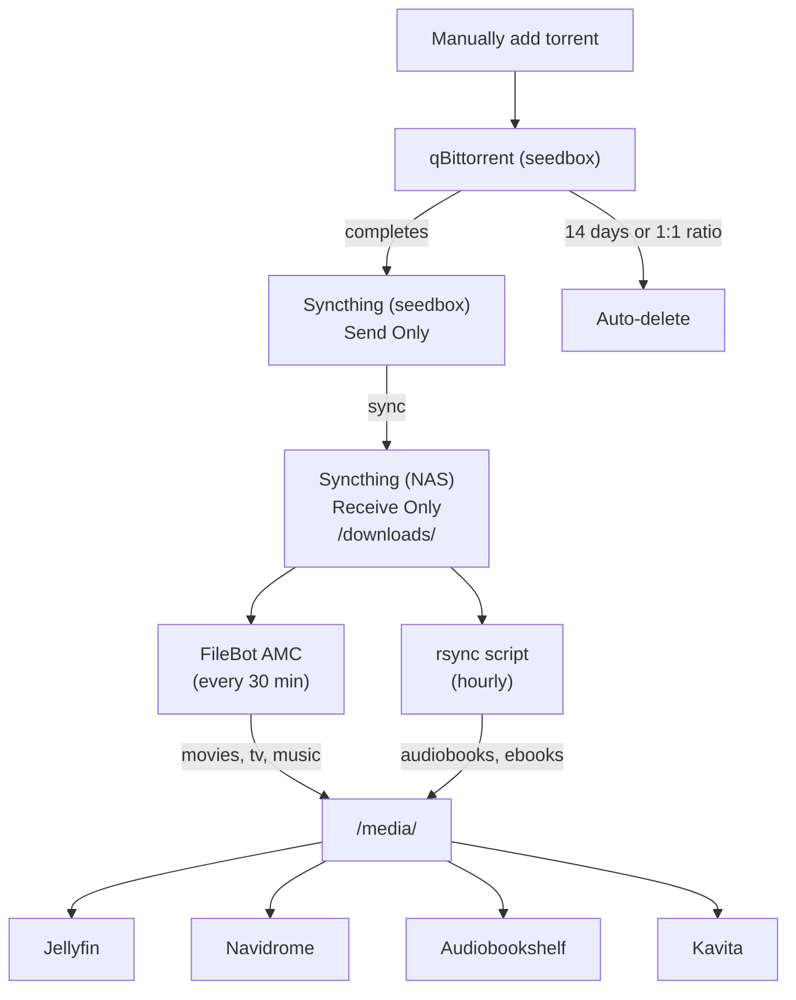

# Media Pipeline

The media pipeline moves content from a remote seedbox to organized local libraries, fully automated after the initial download.

:::warning Disclaimer
This setup is used for downloading and managing **legally obtained media** — DRM-free purchases, personal backups, public domain content, Creative Commons works, and similar. A seedbox and torrent client are legitimate tools with many legal use cases (Linux ISOs, open-source software distribution, freely available media). Please respect copyright law in your jurisdiction and only download content you have the right to access.
:::

## Overview



## Step-by-Step Flow

1. **Manually find and add torrent** to qBittorrent on the seedbox, **tagging it with a category** (movies, tv, music, audiobooks, ebooks) — this determines which download folder it lands in
2. **qBittorrent downloads** to `~/downloads/qbittorrent/complete/{category}/`
3. **Syncthing syncs** completed files to NAS at `/downloads/{category}/` (daily rescan from seedbox, Receive Only on NAS)
4. **FileBot AMC script** runs every 30 minutes — auto-sorts movies, TV, and music into `/media/` with proper naming
5. **rsync script** runs hourly — copies audiobooks and ebooks into `/media/`
6. **Streaming apps** pick up new content automatically (library scan)
7. **qBittorrent seeds** for 14 days or until 1:1 ratio, then auto-deletes the files

## Seedbox Configuration

| Property | Value |
|----------|-------|
| Provider | [your-seedbox-provider] |
| Plan | [your-plan-name] |
| Storage | 8TB |
| Torrent Client | qBittorrent |
| Sync | Syncthing (Send Only) |

### qBittorrent Categories

Each torrent is manually assigned a category when added. The category determines the save path, which keeps downloads organized before Syncthing picks them up:

| Category | Save Path |
|----------|-----------|
| movies | `~/downloads/qbittorrent/complete/movies` |
| tv | `~/downloads/qbittorrent/complete/tv` |
| music | `~/downloads/qbittorrent/complete/music` |
| audiobooks | `~/downloads/qbittorrent/complete/audiobooks` |
| ebooks | `~/downloads/qbittorrent/complete/ebooks` |

### Seeding Limits

| Setting | Value |
|---------|-------|
| When ratio reaches | 1.0 |
| When seeding time reaches | 14 days (20160 minutes) |
| Then | Remove torrent and its files |

## Syncthing Configuration

### Seedbox Side

| Setting | Value |
|---------|-------|
| Folder | `~/downloads/qbittorrent/complete` |
| Folder Type | Send Only |
| Watch for Changes | Disabled (provider fair usage policy) |
| Full Rescan Interval | 86400 seconds (24 hours) |

:::warning
Most seedbox providers have fair usage policies. Do **not** enable "Watch for Changes" or set fast rescan intervals. Keep the rescan at daily (86400 seconds) minimum.
:::

### NAS Side (VMID 108)

| Setting | Value |
|---------|-------|
| Folder Type | Receive Only |
| Local Path | `/downloads` (bind mount to hdd-pool/downloads) |

## FileBot Configuration (VMID 119)

FileBot runs the AMC (Automated Media Center) script on a 30-minute cron:

| Property | Value |
|----------|-------|
| VMID | 119 |
| IP | 10.1.10.119 |
| License | [your-filebot-license] |

### Storage Mounts

| Container Path | Host Path | Access |
|----------------|-----------|--------|
| `/downloads` | hdd-pool/downloads | Read-write |
| `/media/movies` | hdd-pool/media/movies | Read-write |
| `/media/tv` | hdd-pool/media/tv | Read-write |
| `/media/music` | hdd-pool/media/music | Read-write |
| `/media/audiobooks` | hdd-pool/media/audiobooks | Read-write |
| `/media/ebooks` | hdd-pool/media/ebooks | Read-write |

### What Gets Sorted

- **FileBot AMC** (30-min cron): movies, TV shows, music — auto-renamed and organized
- **rsync script** (hourly): audiobooks and ebooks — copied to `/media/` as-is

## Why Not the *arr Stack?

I originally planned to use Sonarr, Radarr, and the rest of the *arr stack for automated media management. After trying it, I decided against it for one main reason: **I wanted control over exactly what gets downloaded.**

With the *arr stack, when multiple versions of a release are available — different encoders, resolutions, file sizes, audio tracks — the automation picks for you based on quality profiles. That's great for a hands-off experience, but I prefer to evaluate the options myself and choose the specific release I want.

The current approach — manually selecting torrents and letting FileBot + Syncthing handle organization and delivery — gives me that control while still automating everything *after* the initial download decision. It's the best of both worlds for my workflow.

:::tip
The *arr stack is an excellent choice if you prefer fully automated media acquisition with minimal manual intervention. It's just not the right fit for everyone. If you want control over individual release selection, a manual + FileBot approach like this one might suit you better.
:::

## Media Folder Structure

```
/media/
├── movies/
│   └── Movie Name (Year)/
│       └── Movie Name (Year).mkv
├── tv/
│   └── Show Name/
│       └── Season 01/
│           └── Show Name - S01E01 - Episode Title.mkv
├── music/
│   └── Artist/
│       └── Album/
│           └── 01 - Track.flac
├── audiobooks/
│   └── Author/
│       └── Book Title/
│           └── audiobook files
└── ebooks/
    └── Author/
        └── Book Title.epub
```

## Immediate Sync

To sync files immediately instead of waiting for the daily rescan:

1. Open Syncthing UI on the seedbox
2. Click the shared folder → **Rescan**
3. Files sync immediately to the NAS

## Related Pages

- [Jellyfin](./jellyfin.md) — movies and TV streaming
- [Navidrome](./navidrome.md) — music streaming
- [Audiobookshelf](./audiobookshelf.md) — audiobook streaming
- [Kavita](./kavita.md) — ebook reading
- [Tycho](../../hosts/tycho.md) — NAS host and storage layout
