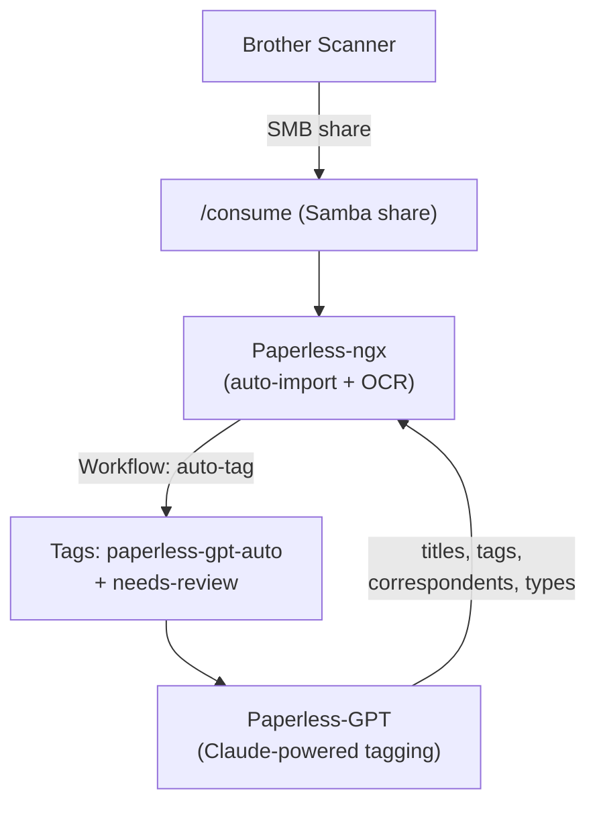

# Paperless-ngx

Document management system with OCR processing, automatic import from a scanner via Samba, and AI-powered tagging via [Paperless-GPT](../ai/paperless-gpt.md).

## Overview

| Property | Value |
|----------|-------|
| **VMID** | 114 |
| **IP** | 10.1.10.114 |
| **VLAN** | 10 |
| **Host** | tycho |
| **Type** | LXC (with Docker) |
| **OS** | Debian 13 |
| **Port** | 8000 |
| **URL** | `https://docs.hake.rodeo` |

## Resources

| Resource | Value |
|----------|-------|
| vCPU | 2 |
| RAM | 8GB (increased from 2GB — Celery workers were OOM-killed during OCR) |
| Swap | 2GB |
| Disk | 12GB |

## Storage Mounts

| Container Path | Host Path | Access |
|----------------|-----------|--------|
| `/consume` | hdd-pool/documents/consume | Read-write |
| `/archive` | hdd-pool/documents/archive | Read-write |

## Components

Includes internally: Postgres 16, Redis, Tesseract OCR.

## Document Workflow

1. **Scan documents** using the Brother scanner — files land in the Samba `/consume` share
2. **Paperless-ngx** watches the consumption folder and auto-imports new documents with OCR
3. **Workflow** automatically assigns `paperless-gpt-auto` + `needs-review` tags to every new document
4. **[Paperless-GPT](../ai/paperless-gpt.md)** picks up tagged documents and uses Claude to assign titles, tags, correspondents, and document types
5. **Review**: `needs-review` tag flags documents for manual OCR quality check — remove when satisfied, or add `paperless-gpt-ocr-auto` for Claude to re-OCR via vision

## Configuration

Key settings in `/opt/paperless/paperless.conf`:

| Setting | Value |
|---------|-------|
| `PAPERLESS_URL` | `https://docs.hake.rodeo` |
| `PAPERLESS_CSRF_TRUSTED_ORIGINS` | `https://docs.hake.rodeo,http://10.1.10.114:8000` |

## Client Apps

- **iOS**: Swift Paperless (free)
- **Web**: `docs.hake.rodeo`

## Installation

Installed via Proxmox community helper script.

## Related Pages

- [Paperless-GPT](../ai/paperless-gpt.md) — Claude-powered auto-tagging
- [Paperless-AI](../ai/paperless-ai.md) — RAG document chat
- [Samba](./samba.md) — scanner intake share
- [Tycho](../../hosts/tycho.md) — host details
